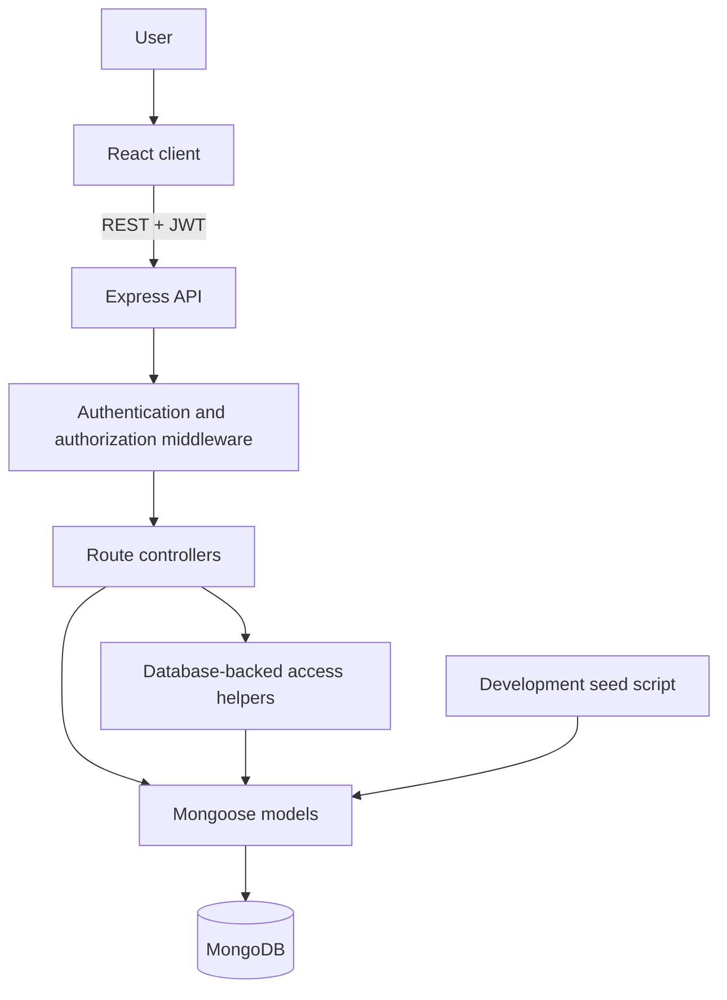

# CollaBoard

CollaBoard is a collaborative Kanban task-management application developed as a third-year group project. It organizes work using a **Workspace → Project → Workflow Status → Task** hierarchy and provides role-based access for internal members and guests.

Users can create Workspaces and Projects, manage access, customize workflows, assign Tasks to eligible members, select Task Reporters, and work in either Kanban or List view.

## Current status

The current development build provides a React client connected to a protected Express REST API, with application data persisted in MongoDB through Mongoose.

Implemented:

- user registration and login;
- password hashing and JWT authentication;
- protected client and server routes;
- MongoDB persistence for application data;
- Workspace creation, viewing, editing, and deletion;
- Workspace Owner, Admin, Member, and Guest roles;
- Workspace-wide member and Project-access management;
- Project creation, viewing, editing, and deletion;
- open and private Project visibility;
- Project Owner, Contributor, and Reviewer roles;
- Project ownership transfer;
- Project invitations for internal users and guests;
- Workspace-level bulk invitations across multiple Projects;
- independent Contributor or Reviewer roles for each invited Project;
- invitation acceptance, decline, and cancellation;
- customizable and reorderable Project workflow statuses;
- Kanban and List Task views;
- Task creation, viewing, editing, movement, and deletion;
- drag-and-drop Task movement;
- multiple Task Assignees;
- Task Due Dates and due-state indicators;
- immutable Task creator tracking;
- assignable Project-member Task Reporters;
- role-based Reporter reassignment;
- optimistic Task-version conflict detection;
- consistent JSON error responses;
- guarded development database seeding;
- responsive layouts.

Docker configuration, automated test suites, real-time updates, and public deployment remain planned.

## Domain model

```text
Workspace
├── Workspace members
│   ├── Owner
│   ├── Admin
│   ├── Member
│   └── Guest
└── Projects
    ├── Project members
    │   ├── Owner
    │   ├── Contributor
    │   └── Reviewer
    ├── Workflow statuses
    └── Tasks
        ├── Original creator
        ├── Reporter
        ├── Assignees
        ├── Due Date
        └── Version
```

A Workspace can represent a department, team, or other organizational unit. Projects contain their own membership rules, visibility, workflow statuses, and Tasks.

The Task creator and Reporter are stored independently. The creator is assigned automatically when the Task is created and remains immutable. The Reporter may be selected from current Project members and reassigned only by an authorized user.

## Access model

### Workspace roles

| Role | Purpose |
|---|---|
| Owner | Full control of the Workspace and its access model |
| Admin | Manages Workspace members and access, subject to owner protections |
| Member | Internal Workspace user who may inherit access to open Projects |
| Guest | External Workspace user who requires explicit Project access |

### Project roles

| Role | Purpose |
|---|---|
| Owner | Full Project control, including access and workflow management |
| Contributor | Creates, edits, moves, and completes Tasks |
| Reviewer | Read-only Project access |

### Open and private Projects

- **Open Project:** internal Workspace members can discover and read it even without explicit Project membership. Their inherited access is equivalent to read-only Reviewer access.
- **Private Project:** only explicit Project members can access it.
- **Guests:** never inherit access to open Projects. A guest must be explicitly added to each Project they need to access.
- **Task Assignees:** Project Owners and Contributors are eligible Assignees. Reviewers are not assignable.
- **Task Reporters:** any current explicit Project member may be selected as Reporter, including Reviewers. Reporter status does not grant additional permissions.

### Reporter reassignment

A Task Reporter may be reassigned by:

- the original Task creator, while still a Project member;
- the Project Owner;
- the Workspace Owner;
- a Workspace Admin.

Changing the Reporter does not change the original creator, Assignees, Due Date, workflow status, or permissions.

### Members & Access

Workspace Owners and Admins can open the **Members & Access** page to:

- view every internal member and guest in the Workspace;
- see each member's Workspace role and relationship type;
- inspect every Project the member can access;
- distinguish explicit access from inherited open-Project access;
- inspect the member's effective Project role and permissions;
- change eligible Workspace roles;
- grant explicit Project access;
- change a Project member between Contributor and Reviewer;
- remove explicit Project access without removing inherited open-Project access;
- invite internal members or guests to multiple Projects in one operation;
- assign an independent Contributor or Reviewer role to every selected Project;
- review and cancel pending internal and guest invitations;
- remove a Workspace member, subject to ownership protections.

Removing a Workspace member also removes that user from the Workspace's Projects, clears their Task assignments in those Projects, and cleans up applicable pending invitations. Workspace and Project owners must be reassigned before they can be removed or changed in a way that would leave owned resources without an owner.

Removing a member does not erase historical Task creator or Reporter identifiers. A removed Reporter can later be replaced by an authorized user with a current Project member.

## Technology stack

| Area | Technology |
|---|---|
| Client | React |
| Build tool | Vite |
| Routing | React Router |
| Styling | CSS |
| Server | Node.js and Express |
| Authentication | JSON Web Tokens |
| Password hashing | bcrypt.js |
| Data persistence | MongoDB through Mongoose |
| Client session persistence | Browser `localStorage` |
| Testing | Jest, Supertest, and React Testing Library — planned |
| Real-time updates | Socket.IO — planned |
| Deployment | Docker Compose and public hosting — planned |

## Prerequisites

Install:

- Node.js 22 or newer;
- npm;
- Git;
- MongoDB, either as a local service or through a compatible hosted MongoDB connection.

The local examples use:

```text
mongodb://127.0.0.1:27017/collaboard
```

## Installation

Clone the repository:

```bash
git clone https://github.com/SanukaWaravita/collaboard_2.git
cd collaboard_2
```

Install the client dependencies:

```bash
cd client
npm install
cd ..
```

Install the server dependencies:

```bash
cd server
npm install
cd ..
```

If the repository URL changes, use the exact URL shown under the GitHub repository's **Code** button.

## Server configuration

Create a local environment file from the example:

```bash
cd server
cp .env.example .env
```

Configure the following values in `server/.env`:

```dotenv
PORT=5000
MONGODB_URI=mongodb://127.0.0.1:27017/collaboard
MONGODB_DATABASE_NAME=collaboard
JWT_SECRET=replace-this-with-a-long-random-secret
JWT_EXPIRES_IN=1h
SEED_DEVELOPMENT_DATA=false
DEVELOPMENT_SEED_PASSWORD=CollaBoard123!
```

`MONGODB_URI` must include the intended database name. For local development, both `MONGODB_URI` and `MONGODB_DATABASE_NAME` should identify `collaboard`.

Generate a random development JWT secret with:

```bash
openssl rand -hex 32
```

Replace the placeholder `JWT_SECRET` with the generated value. Do not commit the real `server/.env` file; only safe placeholders and required variable names belong in `server/.env.example`.

For a hosted MongoDB service, replace the local URI with the service's connection string and ensure the database name is included in the URI path. Keep credentials out of Git.

## Development seed data

CollaBoard includes optional development seed data for repeatable local testing.

Seeding writes the demonstration dataset to MongoDB. It is an explicit, destructive operation: the seed script resets the selected development database before writing the new data.

Before running the seed, configure the ignored `server/.env` file with:

```dotenv
MONGODB_URI=mongodb://127.0.0.1:27017/collaboard
MONGODB_DATABASE_NAME=collaboard
SEED_DEVELOPMENT_DATA=true
DEVELOPMENT_SEED_PASSWORD=CollaBoard123!
```

From the `server` directory, run:

```bash
npm run seed:development -- --confirm-reset
```

The script validates the seed data, resets the approved development database, writes the dataset, and prints the resulting document counts.

The reset is blocked unless the development-seeding safeguards pass. Never run the seed command against a production database.

Starting or restarting the Express API does not automatically reseed MongoDB. Runtime changes remain stored until they are updated, deleted, or deliberately reset by the seed command.

After seeding, return `SEED_DEVELOPMENT_DATA` to `false` if you do not intend to reset the database again. This flag does not disable MongoDB persistence or empty the existing database.

Unless `DEVELOPMENT_SEED_PASSWORD` is changed, all sample accounts use:

```text
CollaBoard123!
```

### Sample accounts

| User | Email | Testing purpose |
|---|---|---|
| Olivia Owner | `owner@collaboard.dev` | Workspace and Project ownership |
| Adrian Admin | `admin@collaboard.dev` | Workspace administration |
| Casey Contributor | `internal.contributor@collaboard.dev` | Internal contribution and Task assignment |
| Riley Reviewer | `internal.reviewer@collaboard.dev` | Explicit internal Reviewer restrictions |
| Morgan Observer | `observer@collaboard.dev` | Inherited access to open Projects |
| Jordan Guest Contributor | `guest.contributor@collaboard.dev` | Explicit guest Contributor access |
| Taylor Guest Reviewer | `guest.reviewer@collaboard.dev` | Explicit guest Reviewer restrictions |
| Avery Invitee | `invitee@collaboard.dev` | Pending invitation flow |

The seed includes:

- two Workspaces;
- open and private Projects;
- internal and guest memberships;
- explicit and inherited Project access;
- default and custom workflows;
- Tasks across multiple statuses;
- unassigned, singly assigned, and multiply assigned Tasks;
- independently stored Task creators and Reporters;
- relative Due Dates representing overdue, due-soon, and later work;
- a pending invitation.

### Aurora Digital Solutions demo accounts

The company demonstration data represents a fictional organization with departmental Workspaces.

| User | Email | Testing purpose |
|---|---|---|
| Nadia Perera | `company.rep@aurora.example` | Company representative and Owner of every department Workspace |
| Ashan Silva | `product.lead@aurora.example` | Product & Engineering administration |
| Dinithi Jayasinghe | `marketing.lead@aurora.example` | Marketing & Growth administration |
| Kavindu Fernando | `sales.lead@aurora.example` | Sales & Partnerships administration |
| Malsha Wijeratne | `success.lead@aurora.example` | Customer Success administration |
| Nethmi Karunaratne | `people.lead@aurora.example` | People & Culture administration |
| Tharindu Senanayake | `operations.lead@aurora.example` | Finance & Operations administration |

Unless `DEVELOPMENT_SEED_PASSWORD` is changed, all company demo accounts use:

```text
CollaBoard123!
```

The Aurora company demonstration includes:

- one company-representative account;
- six department-lead accounts;
- six department Workspaces;
- two members per Workspace;
- three Projects per department;
- 18 Projects altogether;
- open and private Project visibility;
- default To Do, Doing, and Done workflows;
- five Tasks per Project;
- 90 realistic Tasks altogether;
- completed, overdue, current, upcoming, and unset Due Dates;
- unassigned, singly assigned, and multiply assigned Tasks;
- explicit Workspace and Project memberships.

### Validate the company demo seed

Run:

```bash
cd server
npm run validate:company-seed
```

The validator checks:

- expected company data totals;
- duplicate identifiers;
- Workspace ownership and memberships;
- Project ownership and memberships;
- Project workflow statuses;
- Task-to-Project relationships;
- Task creator, Reporter, and Assignee memberships;
- Task status, version, and Due Date values.

Validation generates a temporary seed-data object for consistency checks but does not connect to MongoDB, reset the database, or write documents.

## Running the application

Ensure MongoDB is running and the server environment variables are configured. The client and server then run in separate terminals.

### Terminal 1: API server

```bash
cd server
npm run dev
```

The API normally runs at:

```text
http://localhost:5000
```

A successful startup should report the connected MongoDB database before reporting the API URL.

### Terminal 2: React client

```bash
cd client
npm run dev
```

Open the URL displayed by Vite, normally:

```text
http://localhost:5173
```

## Available scripts

### Client scripts

Run from `client`:

| Command | Purpose |
|---|---|
| `npm run dev` | Start the Vite development server |
| `npm run lint` | Check client code with ESLint |
| `npm run build` | Create the production client build |
| `npm run preview` | Preview the production build locally |

### Server scripts

Run from `server`:

| Command | Purpose |
|---|---|
| `npm run dev` | Start the API with Nodemon |
| `npm start` | Start the API with Node.js |
| `npm run validate:company-seed` | Validate the company demonstration seed definitions |
| `npm run seed:development -- --confirm-reset` | Reset the approved development database and write seed data |

Automated test scripts are planned but are not yet part of the current repository.

## Client routes

| Route | Access | Screen |
|---|---|---|
| `/login` | Public | Login |
| `/register` | Public | Registration |
| `/workspaces` | Protected | Accessible Workspaces |
| `/workspaces/:workspaceId/projects` | Protected | Workspace Projects |
| `/workspaces/:workspaceId/members` | Workspace management permission | Members & Access |
| `/workspaces/:workspaceId/projects/:projectId` | Project access required | Kanban/List Project view |
| `/workspaces/:workspaceId/projects/:projectId/access` | Project access management permission | Project members and invitations |
| `/invitations` | Protected | Current user's pending invitations |

## API overview

Local API base URL:

```text
http://localhost:5000/api
```

Protected endpoints require:

```http
Authorization: Bearer <token>
```

### Public endpoints

| Method | Endpoint | Purpose |
|---|---|---|
| `POST` | `/api/auth/register` | Register a user |
| `POST` | `/api/auth/login` | Log in |
| `GET` | `/api/health` | Check API health |

### Workspace endpoints

| Method | Endpoint | Purpose |
|---|---|---|
| `GET` | `/api/workspaces` | List accessible Workspaces |
| `POST` | `/api/workspaces` | Create a Workspace |
| `GET` | `/api/workspaces/:workspaceId` | Get a Workspace |
| `PATCH` | `/api/workspaces/:workspaceId` | Update a Workspace |
| `DELETE` | `/api/workspaces/:workspaceId` | Delete a Workspace and its related data |
| `GET` | `/api/workspaces/:workspaceId/projects` | List accessible Projects in a Workspace |
| `POST` | `/api/workspaces/:workspaceId/projects` | Create a Project |

### Workspace member and access endpoints

| Method | Endpoint | Purpose |
|---|---|---|
| `GET` | `/api/workspaces/:workspaceId/members` | List Workspace members and effective Project access |
| `PATCH` | `/api/workspaces/:workspaceId/members/:userId` | Change an eligible Workspace role |
| `DELETE` | `/api/workspaces/:workspaceId/members/:userId` | Remove a Workspace member and related access |
| `PUT` | `/api/workspaces/:workspaceId/members/:userId/projects/:projectId` | Grant or update explicit Project access |
| `DELETE` | `/api/workspaces/:workspaceId/members/:userId/projects/:projectId` | Remove explicit Project access |
| `POST` | `/api/workspaces/:workspaceId/invitations` | Create invitations for one or more Workspace Projects |
| `DELETE` | `/api/workspaces/:workspaceId/invitations/:invitationId` | Cancel a pending Workspace invitation |

### Project endpoints

| Method | Endpoint | Purpose |
|---|---|---|
| `GET` | `/api/projects` | List Projects accessible to the current user |
| `GET` | `/api/projects/:projectId` | Get a Project, workflow, and Tasks |
| `PATCH` | `/api/projects/:projectId` | Update a Project |
| `DELETE` | `/api/projects/:projectId` | Delete a Project and its related data |
| `GET` | `/api/projects/:projectId/members` | List explicit Project members |
| `PATCH` | `/api/projects/:projectId/members/:userId` | Change a Project member's role |
| `DELETE` | `/api/projects/:projectId/members/:userId` | Remove explicit Project membership |
| `POST` | `/api/projects/:projectId/transfer-ownership` | Transfer Project ownership |

### Invitation endpoints

| Method | Endpoint | Purpose |
|---|---|---|
| `GET` | `/api/projects/:projectId/invitations` | List pending Project invitations |
| `POST` | `/api/projects/:projectId/invitations` | Invite an internal user or guest |
| `DELETE` | `/api/projects/:projectId/invitations/:invitationId` | Cancel an invitation |
| `GET` | `/api/invitations` | List invitations for the current user |
| `POST` | `/api/invitations/:invitationId/accept` | Accept an invitation |
| `POST` | `/api/invitations/:invitationId/decline` | Decline an invitation |

### Workflow status endpoints

| Method | Endpoint | Purpose |
|---|---|---|
| `GET` | `/api/projects/:projectId/statuses` | List Project workflow statuses |
| `POST` | `/api/projects/:projectId/statuses` | Create a workflow status |
| `PATCH` | `/api/projects/:projectId/statuses/:statusId` | Update a workflow status |
| `DELETE` | `/api/projects/:projectId/statuses/:statusId` | Delete an eligible workflow status |
| `PUT` | `/api/projects/:projectId/statuses/order` | Reorder workflow statuses |

### Task endpoints

| Method | Endpoint | Purpose |
|---|---|---|
| `POST` | `/api/projects/:projectId/tasks` | Create a Task |
| `GET` | `/api/tasks/:taskId` | Get a Task |
| `PATCH` | `/api/tasks/:taskId` | Edit, move, assign, or change a Task Reporter |
| `DELETE` | `/api/tasks/:taskId` | Delete a Task |

See the [complete API contract](docs/api-contract.md) for request bodies, responses, permissions, status codes, and conflict behavior.

## Project structure

```text
collaboard_2/
├── client/
│   ├── src/
│   │   ├── components/
│   │   ├── constants/
│   │   ├── pages/
│   │   ├── services/
│   │   ├── styles/
│   │   ├── utils/
│   │   ├── App.jsx
│   │   └── main.jsx
│   ├── .env.example
│   └── package.json
├── server/
│   ├── scripts/
│   │   ├── seedDatabase.js
│   │   └── validateCompanyDemoSeed.js
│   ├── src/
│   │   ├── config/
│   │   ├── constants/
│   │   ├── controllers/
│   │   ├── data/
│   │   ├── middleware/
│   │   ├── models/
│   │   ├── routes/
│   │   ├── utils/
│   │   ├── app.js
│   │   └── server.js
│   ├── .env.example
│   └── package.json
├── docs/
│   ├── api-contract.md
│   ├── component-tree.md
│   ├── requirements.md
│   └── wireframes.md
├── .gitignore
└── README.md
```

## Current architecture



MongoDB is the persistent source of truth for users, Workspaces, memberships, Projects, invitations, embedded workflow statuses, and Tasks.

The server enforces permissions independently of the client. Hiding a client control is not treated as authorization; protected operations are validated again by the API.

## MongoDB persistence

The application persists:

- users and password hashes;
- Workspaces and Workspace memberships;
- Projects, Project memberships, and embedded workflow statuses;
- Project invitations;
- Tasks, Due Dates, Assignees, creator history, Reporter assignment, and optimistic-lock versions.

Restarting the API does not remove or restore application data. Development data changes only when the application modifies it or when the guarded seed command deliberately resets the selected development database.

## Task conflict detection

Each Task contains a numeric `version`.

When a client edits a Task, it submits the version it originally loaded. The server performs an atomic update that includes the expected version:

- matching versions allow the update;
- the server increments the version after a successful update;
- an outdated version returns `409 Conflict`;
- the response contains the newest Task;
- the client displays the current Task instead of silently overwriting it.

This provides optimistic concurrency control for Task edits. Real-time update delivery remains planned with Socket.IO.

## Documentation

- [Requirements](docs/requirements.md)
- [Wireframes](docs/wireframes.md)
- [Component tree](docs/component-tree.md)
- [REST API contract](docs/api-contract.md)

## Current limitations

- JWTs are stored in browser `localStorage`.
- Automated client and server test suites are not implemented yet.
- Real-time Socket.IO updates are not implemented yet.
- Docker configuration and public deployment are not implemented yet.
- Production database hosting, secret management, backups, and operational monitoring are not configured yet.

MongoDB persistence is implemented. Restarting the API does not discard users, Workspaces, Projects, memberships, invitations, workflow statuses, or Tasks.

## Development workflow

The repository uses:

- `main` for stable milestone releases;
- `develop` for integrated development;
- `feature/*`, `fix/*`, and `docs/*` for isolated changes.

Changes are merged through pull requests with meaningful incremental commit history. Before opening a pull request, run the relevant lint, build, syntax, seed-validation, and manual access-control checks, then review the staged diff.
