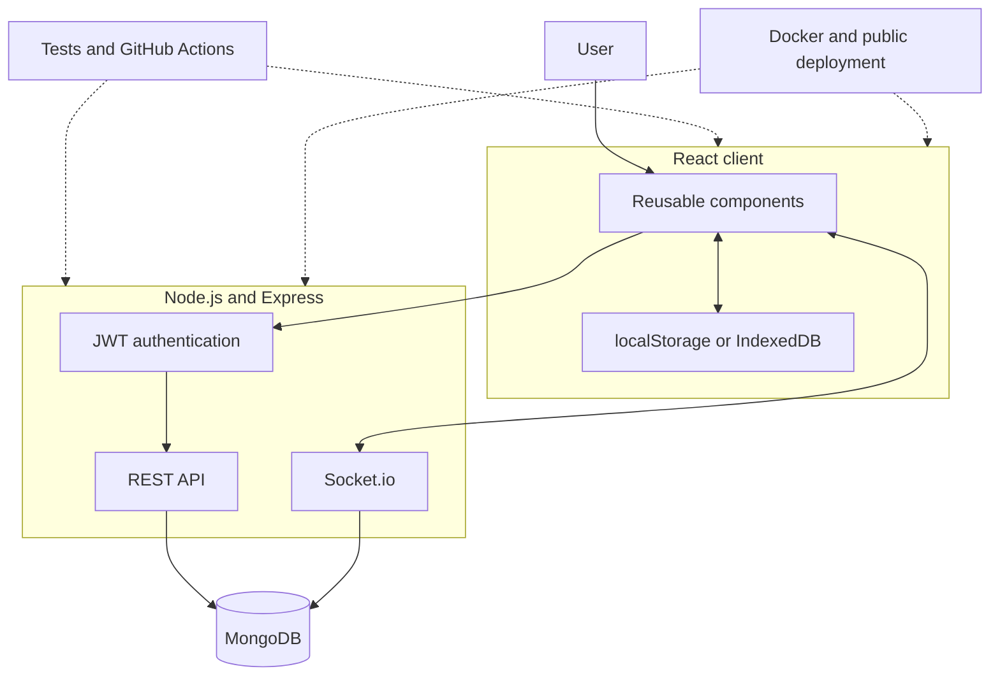

# CollabBoard

CollabBoard is a collaborative Kanban task-management application developed as a third-year group project. It allows teams to organize work using boards and tasks grouped under **To Do**, **Doing**, and **Done**.

## Current status

Milestone 1 provides a responsive React interface powered by temporary mock data.

Implemented:

- login and registration interfaces;
- board listing and board creation;
- three-column Kanban board;
- task creation, editing, status changes, and deletion;
- client-side routing;
- shared navigation;
- responsive layouts;
- requirements, wireframes, and component documentation.

## Technology stack

| Area | Technology |
|---|---|
| Client | React |
| Build tool | Vite |
| Routing | React Router |
| Styling | CSS |
| Code quality | ESLint |
| Server | Node.js and Express — planned |
| Database | MongoDB and Mongoose — planned |
| Real-time updates | Socket.io — planned |
| Testing | Jest, Supertest, React Testing Library — planned |
| Deployment | Docker Compose and public hosting — planned |

## Getting started

### Prerequisites

- Node.js 22 or newer
- npm
- Git

### Installation

Clone the repository:

```bash
git clone https://github.com/SanukaWaravita/collaboard_2.git
cd collaboard
```

Install client dependencies:

```bash
cd client
npm install
```

Start the development server:

```bash
npm run dev
```

Open the local URL displayed by Vite, normally:

```text
http://localhost:5173
```

## Available scripts

Run these commands from the `client` directory:

```bash
npm run dev
```

Starts the development server.

```bash
npm run lint
```

Checks the client code for linting problems.

```bash
npm run build
```

Creates a production build.

```bash
npm run preview
```

Previews the production build locally.

## Application routes

| Route | Screen |
|---|---|
| `/login` | Login |
| `/register` | Registration |
| `/boards` | Board list |
| `/boards/:boardId` | Individual Kanban board |

## Project structure

```text
collaboard/
├── client/
│   └── src/
│       ├── components/
│       ├── data/
│       ├── pages/
│       ├── App.jsx
│       ├── index.css
│       └── main.jsx
├── docs/
│   ├── requirements.md
│   ├── wireframes.md
│   └── component-tree.md
├── server/
├── .gitignore
└── README.md
```

## Planned architecture



## Documentation

- [Requirements](docs/requirements.md)
- [Wireframes](docs/wireframes.md)
- [Component tree](docs/component-tree.md)

## Current limitations

- Login and registration are simulated and do not authenticate against a server.
- Boards and tasks use client-side mock data.
- Newly created data resets when the page is refreshed.
- All board routes currently use the same mock task collection.
- The server, database, automated tests, real-time updates, and deployment are not yet implemented.

## Development workflow

The repository uses:

- `main` for stable milestone releases;
- `develop` for integrated development;
- `feature/*`, `fix/*`, and `docs/*` for individual changes.

Changes should be merged into `develop` using pull requests with meaningful commit history.
