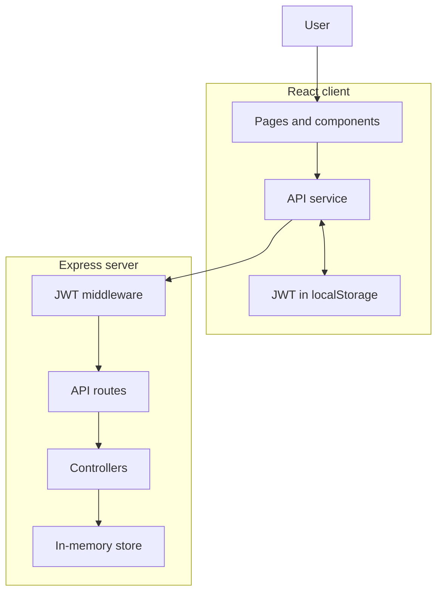

# CollabBoard

CollabBoard is a collaborative Kanban task-management application developed as a third-year group project. Users can register, log in, create boards, and manage tasks across **To Do**, **Doing**, and **Done** columns.

## Current status

Milestone 2 provides a working React client connected to a protected Express REST API.

Implemented:

- user registration and login;
- password hashing;
- JWT authentication;
- protected client and server routes;
- user-owned boards;
- Board creation, viewing, editing, and deletion;
- Task creation, viewing, editing, movement, and deletion;
- three-column Kanban interface;
- task-version conflict detection;
- consistent JSON error responses;
- documented REST API contract;
- responsive layouts.

## Technology stack

| Area | Technology |
|---|---|
| Client | React |
| Build tool | Vite |
| Routing | React Router |
| Styling | CSS |
| Server | Node.js and Express |
| Authentication | JSON Web Tokens |
| Password hashing | bcrypt.js |
| Current data storage | Temporary in-memory store |
| Database | MongoDB and Mongoose — planned for M3 |
| Client persistence | localStorage |
| Testing | Jest, Supertest, React Testing Library — planned for M4 |
| Real-time updates | Socket.io — planned for M5 |
| Deployment | Docker Compose and public hosting — planned for M5 |

## Prerequisites

Install:

- Node.js 22 or newer;
- npm;
- Git.

## Installation

Clone the repository:

```bash
git clone https://github.com/SanukaWaravita/collaboard_2.git
cd collaboard
```

If the GitHub repository has a different name or URL, use the exact URL shown under the repository’s **Code** button.

Install client dependencies:

```bash
cd client
npm install
cd ..
```

Install server dependencies:

```bash
cd server
npm install
cd ..
```

## Server configuration

Create a local server environment file:

```bash
cd server
nano .env
```

Add:

```dotenv
PORT=5000
JWT_SECRET=replace-this-with-a-long-random-secret
JWT_EXPIRES_IN=1h
```

A random development secret can be generated with:

```bash
openssl rand -hex 32
```

Replace `replace-this-with-a-long-random-secret` with the generated value.

Do not commit the real `.env` file. The required variable names are documented in `server/.env.example`.

## Development seed data

Because CollaBoard currently uses an in-memory store, optional development seed data is available for local testing.

Enable it in the ignored `server/.env` file:

```dotenv
SEED_DEVELOPMENT_DATA=true
DEVELOPMENT_SEED_PASSWORD=CollaBoard123!
```

## Running the application

The client and server run in separate terminals.

### Terminal 1: API server

```bash
cd server
npm run dev
```

The API normally runs at:

```text
http://localhost:5000
```

### Terminal 2: React client

```bash
cd client
npm run dev
```

Open the URL displayed by Vite, normally:

```text
http://localhost:5173
```

Because CollaBoard currently uses server memory, runtime changes are not persistent. When development seeding is enabled, restarting the server restores the original seeded users, Workspaces, Projects, memberships, invitations, workflows, and Tasks.

## Available scripts

### Client scripts

Run from `client`:

```bash
npm run dev
```

Starts the Vite development server.

```bash
npm run lint
```

Checks the client code with ESLint.

```bash
npm run build
```

Creates the production client build.

```bash
npm run preview
```

Previews the production build locally.

### Server scripts

Run from `server`:

```bash
npm run dev
```

Starts the API with Nodemon and automatically restarts it after server code changes.

```bash
npm start
```

Starts the API with Node.js.

Automated test scripts will be added during Milestone 4.

## Client routes

| Route | Access | Screen |
|---|---|---|
| `/login` | Public | Login |
| `/register` | Public | Registration |
| `/boards` | Protected | Current user’s boards |
| `/boards/:boardId` | Protected | Individual Kanban board |

## API overview

Local API base URL:

```text
http://localhost:5000/api
```

Protected endpoints require:

```http
Authorization: Bearer <token>
```

### Public endpoints

| Method | Endpoint | Purpose |
|---|---|---|
| `POST` | `/api/auth/register` | Register a user |
| `POST` | `/api/auth/login` | Log in |
| `GET` | `/api/health` | Check API health |

### Protected Board endpoints

| Method | Endpoint | Purpose |
|---|---|---|
| `GET` | `/api/boards` | List the user’s boards |
| `POST` | `/api/boards` | Create a board |
| `GET` | `/api/boards/:boardId` | Get a board and its tasks |
| `PATCH` | `/api/boards/:boardId` | Update a board |
| `DELETE` | `/api/boards/:boardId` | Delete a board and its tasks |

### Protected Task endpoints

| Method | Endpoint | Purpose |
|---|---|---|
| `POST` | `/api/boards/:boardId/tasks` | Create a task |
| `GET` | `/api/tasks/:taskId` | Get a task |
| `PATCH` | `/api/tasks/:taskId` | Edit or move a task |
| `DELETE` | `/api/tasks/:taskId` | Delete a task |

See the [complete API contract](docs/api-contract.md) for request bodies, responses, status codes, and conflict behavior.

## Project structure

```text
collaboard/
├── client/
│   ├── src/
│   │   ├── components/
│   │   ├── data/
│   │   ├── pages/
│   │   ├── services/
│   │   │   └── api.js
│   │   ├── App.jsx
│   │   ├── index.css
│   │   └── main.jsx
│   ├── .env.example
│   └── package.json
├── server/
│   ├── src/
│   │   ├── config/
│   │   ├── controllers/
│   │   ├── data/
│   │   ├── middleware/
│   │   ├── models/
│   │   ├── routes/
│   │   ├── app.js
│   │   └── server.js
│   ├── .env.example
│   └── package.json
├── docs/
│   ├── api-contract.md
│   ├── component-tree.md
│   ├── requirements.md
│   └── wireframes.md
├── .gitignore
└── README.md
```

## Current architecture



## Conflict detection

Each task contains a numeric `version`.

When a client edits a task, it submits the version it originally loaded. The server compares that value with the current stored version:

- matching versions allow the update;
- the server increments the version after a successful update;
- an outdated version returns `409 Conflict`;
- the client displays the newest task version instead of silently overwriting it.

This provides the initial documented approach to concurrent edits. Real-time update delivery will be added with Socket.io during Milestone 5.

## Documentation

- [Requirements](docs/requirements.md)
- [Wireframes](docs/wireframes.md)
- [Component tree](docs/component-tree.md)
- [REST API contract](docs/api-contract.md)

## Current limitations

- Users, boards, and tasks are stored only in server memory.
- Restarting the server resets all runtime changes.
- The first registered user receives the temporary seeded boards.
- The JWT is stored in browser `localStorage`.
- MongoDB persistence is not implemented yet.
- Automated client and server tests are not implemented yet.
- Real-time Socket.io updates are not implemented yet.
- Docker and public deployment are not implemented yet.

These limitations are addressed progressively in Milestones 3–5.

## Development workflow

The repository uses:

- `main` for stable milestone releases;
- `develop` for integrated development;
- `feature/*`, `fix/*`, and `docs/*` for isolated changes.

Changes are merged into `develop` through pull requests with meaningful incremental commit history.