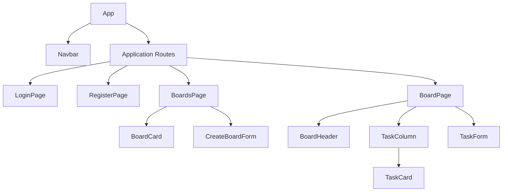

# CollabBoard Component Tree

## 1. Purpose

CollabBoard uses reusable React components. Page components represent complete screens, while shared components represent interface elements that can appear in multiple locations.

## 2. Component hierarchy



## 3. Text representation

```text
App
├── Navbar
└── ApplicationRoutes
    ├── LoginPage
    ├── RegisterPage
    ├── BoardsPage
    │   ├── BoardCard
    │   └── CreateBoardForm
    └── BoardPage
        ├── BoardHeader
        ├── TaskColumn
        │   └── TaskCard
        └── TaskForm
```

The `BoardPage` will render three instances of `TaskColumn`:

- To Do
- Doing
- Done

Each `TaskColumn` will render the `TaskCard` components belonging to its respective status.

## 4. Component responsibilities

| Component         | Responsibility                                       |
| ----------------- | ---------------------------------------------------- |
| `App`             | Top-level application component                      |
| `Navbar`          | Displays navigation and login/logout actions         |
| `LoginPage`       | Displays the login form                              |
| `RegisterPage`    | Displays the account-registration form               |
| `BoardsPage`      | Displays the user's available boards                 |
| `BoardCard`       | Displays a summary of one board                      |
| `CreateBoardForm` | Collects information for a new board                 |
| `BoardPage`       | Displays one Kanban board and its tasks              |
| `BoardHeader`     | Displays the board name and board-level actions      |
| `TaskColumn`      | Displays tasks belonging to one workflow status      |
| `TaskCard`        | Displays one task and its available actions          |
| `TaskForm`        | Collects information when creating or editing a task |

## 5. Planned client structure

```text
client/src/
├── components/
│   ├── Navbar.jsx
│   ├── BoardCard.jsx
│   ├── BoardHeader.jsx
│   ├── TaskColumn.jsx
│   ├── TaskCard.jsx
│   └── TaskForm.jsx
├── pages/
│   ├── LoginPage.jsx
│   ├── RegisterPage.jsx
│   ├── BoardsPage.jsx
│   └── BoardPage.jsx
├── data/
│   └── mockTasks.js
├── App.jsx
├── main.jsx
└── index.css
```

This structure represents the initial Milestone 1 client. API services, authentication state, and real-time communication will be added in later milestones.
