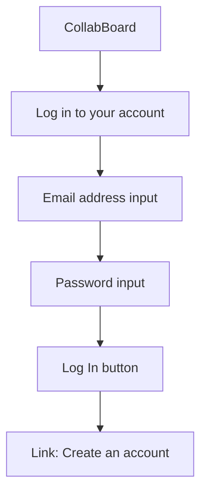
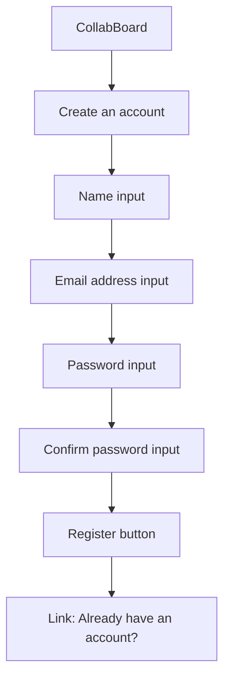
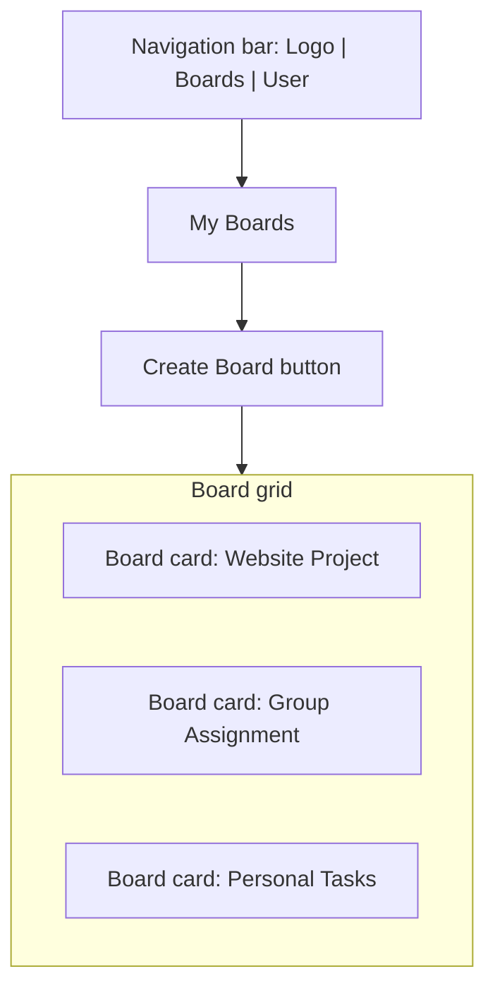
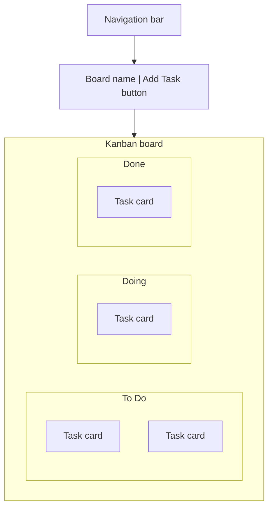
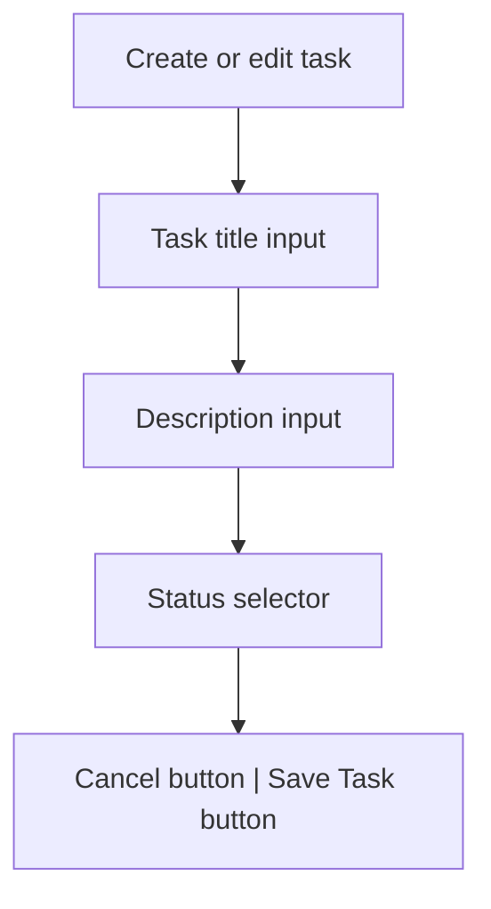
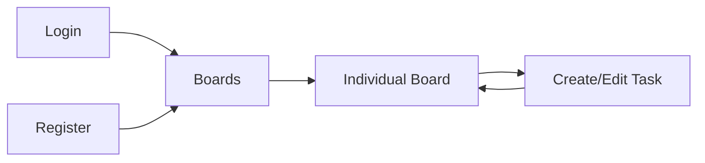

# CollabBoard Wireframes

These wireframes describe the initial layout of the Milestone 1 interface. They represent structure and functionality rather than final colours, typography, or branding.

## 1. Login page

The login form will be displayed in a centred card.

## 2. Register page

The registration form will use the same visual structure as the login form.

## 3. Boards page

Each board card will display:

- board name;
- short description;
- last-updated information;
- button or link for opening the board.

## 4. Individual board page

Each task card will display:

- task title;
- short description;
- current status;
- Edit button;
- Delete button.

Selecting **Add Task** will display the task form.

## 5. Task form

The form may be displayed as a modal or as a panel on the board page.

## 6. Initial navigation flow

These wireframes may be refined as implementation progresses, while preserving the required screens and core functionality.